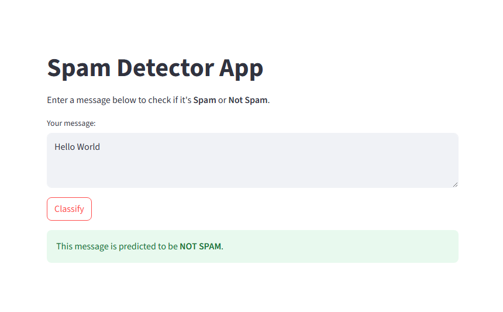

# Streamlit Spam Detector App

This is a simple **Spam Message Classifier** built using Python, Streamlit, and Scikit-learn. It uses a **Naive Bayes classifier** to detect whether a given SMS message is spam or not.

The app provides a clean user interface to input any message, and the model will predict if it's **SPAM** or **NOT SPAM** in real-time.

## Screenshot

##Streamlit Link 
https://abunda-teves-spamdetection.streamlit.app/

## How to Set Up Locally

### 1. Clone the Repository

git clone https://github.com/yourusername/spam-detector-app.git
cd spam-detector-app

### 2. Create & Activate Virtual Environment

python -m venv venv

### Activate it:

# Windows
venv\Scripts\activate
# macOS/Linux
source venv/bin/activate

###3. Install Dependencies

pip install -r requirements.txt

### Run the App

streamlit run main.py"# spam_classificationv2" 
